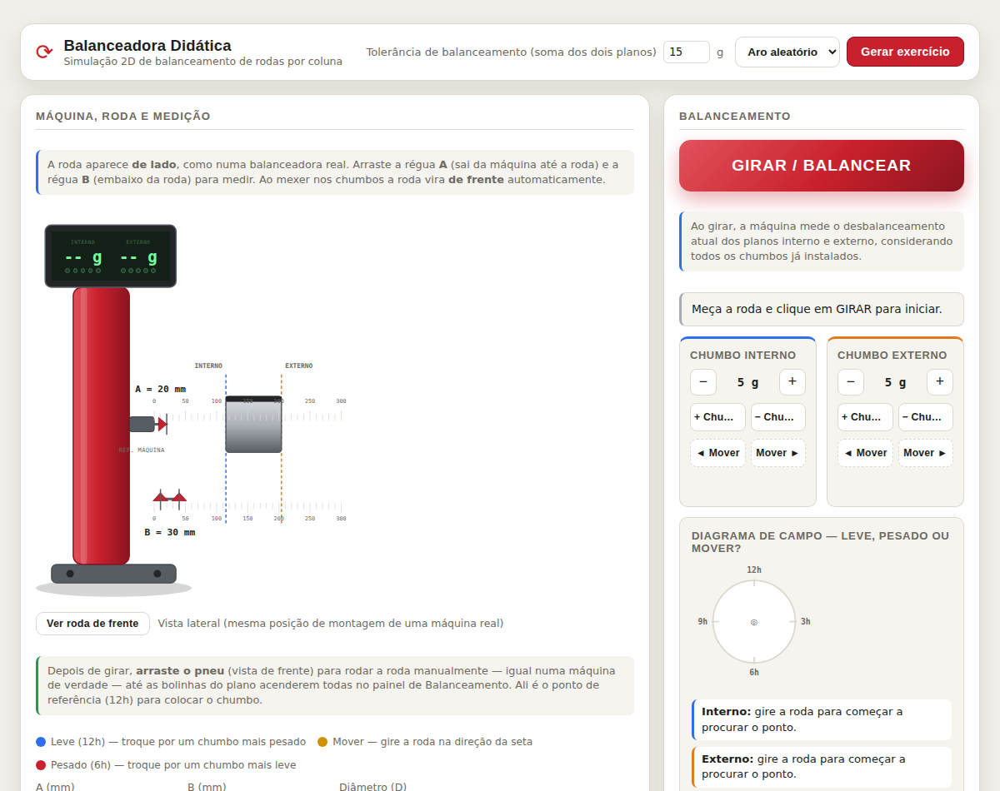
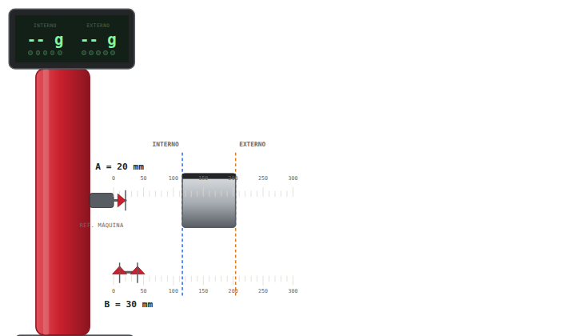
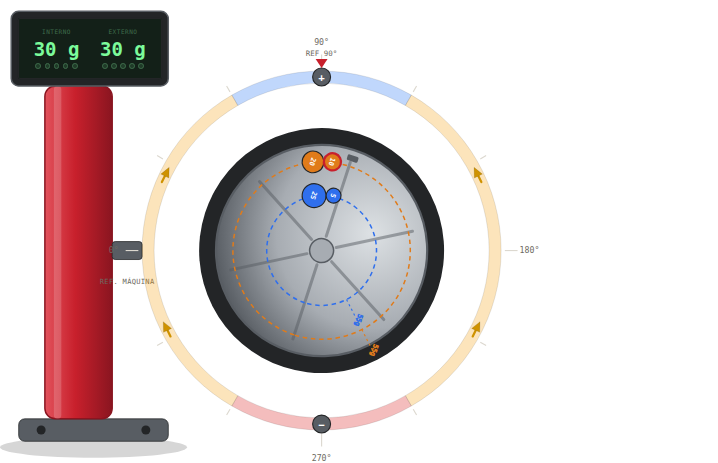
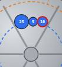
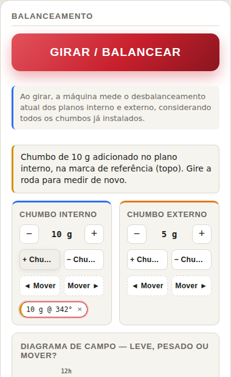
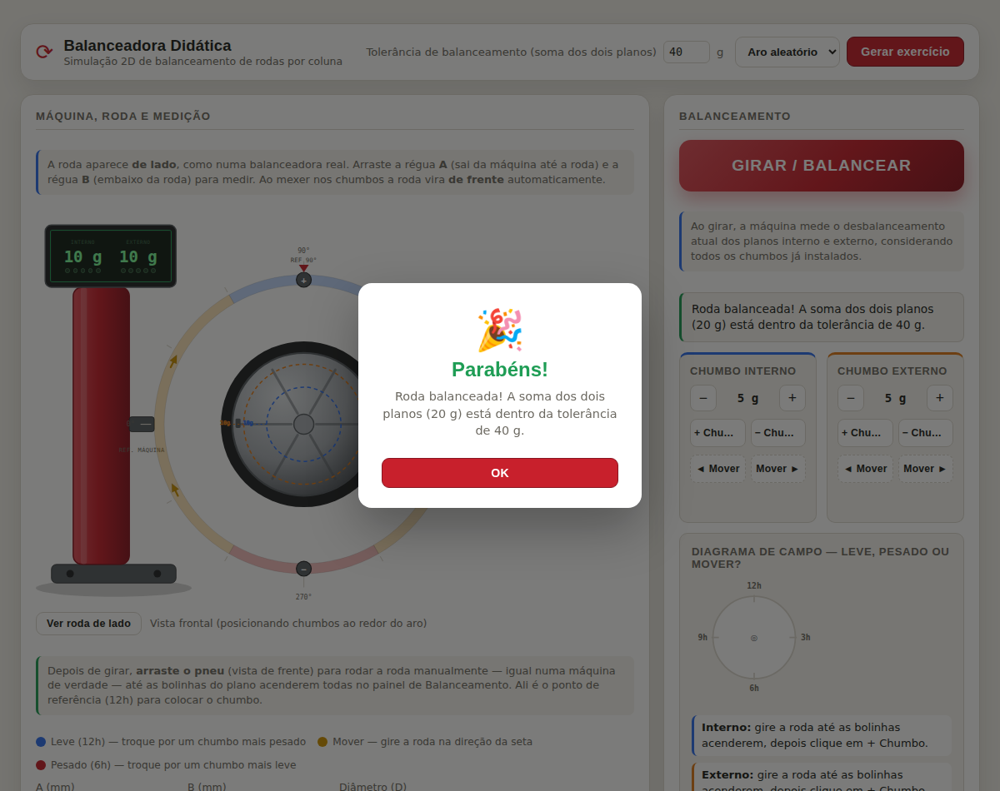

# Balanceadora Didática

Simulação 2D, em HTML/CSS/JS puro (sem frameworks, sem build), de uma balanceadora de rodas de coluna — o tipo de máquina usada em borracharias para medir e corrigir o desbalanceamento de uma roda de carro. O objetivo é didático: ensinar a lógica de medir, girar, interpretar a leitura e colocar chumbo no lugar certo, sem depender de uma máquina de verdade.



## Como funciona

### 1. Medir a roda (vista lateral)

A tela abre com a roda **de lado**, do jeito que ela fica montada numa balanceadora real. Duas réguas saem da máquina:

- **Régua A** — sai da máquina até encostar na roda.
- **Régua B** — embaixo da roda, com duas pontas (interna e externa).

Arraste as réguas com o mouse (ou o dedo, no celular) até encostar na roda — a máquina calcula a medida em milímetros e o diâmetro do aro sozinha. Se preferir, dá pra digitar A, B e o diâmetro direto nos campos numéricos, sem arrastar nada.



### 2. Girar e balancear

Com a roda medida, o botão **GIRAR / BALANCEAR** faz a máquina girar a roda e medir o desbalanceamento atual dos dois planos (interno e externo), considerando todos os chumbos já colocados. O resultado aparece no visor: massa e ângulo que faltam corrigir em cada plano.

### 3. Vista frontal: onde colocar o chumbo

Depois de girar, a roda vira **de frente** automaticamente. É nessa vista que você mexe nos chumbos. Em volta do pneu tem um anel fixo — o **Diagrama de campo** — que não gira com a roda (ele é a referência da própria máquina, sempre com o mesmo topo):

- **Azul (leve, 12h)** — falta peso bem ali; some outro chumbo do lado ou troque por um mais pesado.
- **Vermelho (pesado, 6h)** — tem peso sobrando do lado oposto; troque por um chumbo mais leve.
- **Amarelo (mover)** — o peso está certo, só falta girar a roda até o chumbo cair no lugar (as setas indicam pra que lado).
- Os ícones **+** e **−** no topo/embaixo do anel marcam onde adicionar ou remover chumbo.

Arraste o próprio pneu para girar a roda manualmente até as bolinhas do painel de Balanceamento acenderem todas — esse é o ponto de referência (12h) pra colocar o chumbo.



### 4. Chumbos: sempre um conjunto único

Uma roda raramente fecha a gramatura exata com um chumbo só — por isso dá pra empilhar vários no mesmo ponto (ex.: 25 g + 5 g + 10 g = 40 g), exatamente como um borracheiro faz colando chumbos vizinhos num clipe. No simulador, esse conjunto é tratado como **uma peça só**:

- Os chumbos nascem sempre **lado a lado**, encostados um no outro — nunca empilhados no mesmo ponto.
- O **tamanho de cada chumbo é proporcional à gramatura** (5 g nasce visivelmente menor que 25 g).
- Arrastar **qualquer** chumbo do conjunto arrasta todos juntos — a máquina não sabe separar chumbos colados.
- O botão **Mover** também desloca o conjunto inteiro, e o quanto ele anda por clique não é um valor fixo: é a **largura física real** dos chumbos que estão ali colados (o mesmo total de 50 g anda uma distância diferente se for "dois de 25" ou "dois de 20 e um de 10").



### 5. Painel de Balanceamento

Do lado direito ficam os controles de cada plano (interno e externo): o seletor de gramatura do próximo chumbo (só os valores reais disponíveis numa máquina — 5, 10, 20, 25 g), os botões **+ Chumbo** / **− Chumbo**, **◄ Mover** / **Mover ►**, e a lista dos chumbos já colocados (com botão **×** pra remover um específico). A etiqueta do último chumbo de cada plano fica colorida com o mesmo veredito do Diagrama de Campo (leve / pesado / mover / balanceado).



### 6. Tolerância e o alerta de roda balanceada

No topo da tela dá pra ajustar a **tolerância de balanceamento** (soma dos dois planos, de 0 a 40 g, sempre múltiplo de 5). Quando o desbalanceamento restante fica dentro dela, a máquina considera a roda balanceada e mostra um alerta de confirmação.



### 7. Modo Aprendizado

O painel **Diagrama de campo — leve, pesado ou mover?** (embaixo do painel de Balanceamento) funciona como um guia permanente: mostra num relogiozinho onde está cada chumbo e o alvo real, e escreve por extenso o veredito de cada plano — útil pra quem está aprendendo a ler a máquina antes de confiar só nas cores.

## Estrutura dos arquivos

```
index.html    estrutura da página (painéis, SVG da máquina/roda, modais)
style.css     todo o visual (cores, layout, responsivo, temas claro/escuro)
script.js     toda a lógica: geometria, física do desbalanceamento, interações
```

Tudo em JavaScript puro (sem dependências), rodando inteiramente no navegador — basta abrir o `index.html`.

## Rodando localmente

Não precisa de servidor nem de instalação: é abrir o `index.html` em qualquer navegador. Se preferir servir por HTTP (por exemplo pra testar no celular na mesma rede), qualquer servidor estático simples funciona:

```bash
npx serve .
# ou
python3 -m http.server
```

---

*Simulação didática — não reproduz o algoritmo interno de nenhuma balanceadora comercial.*
